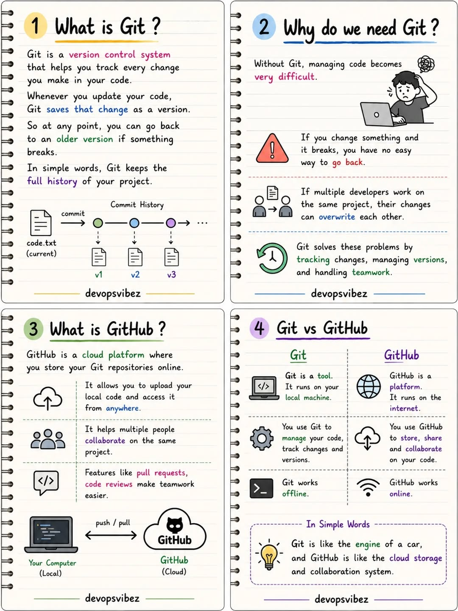
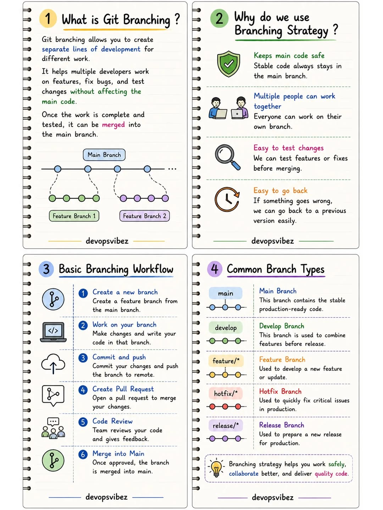
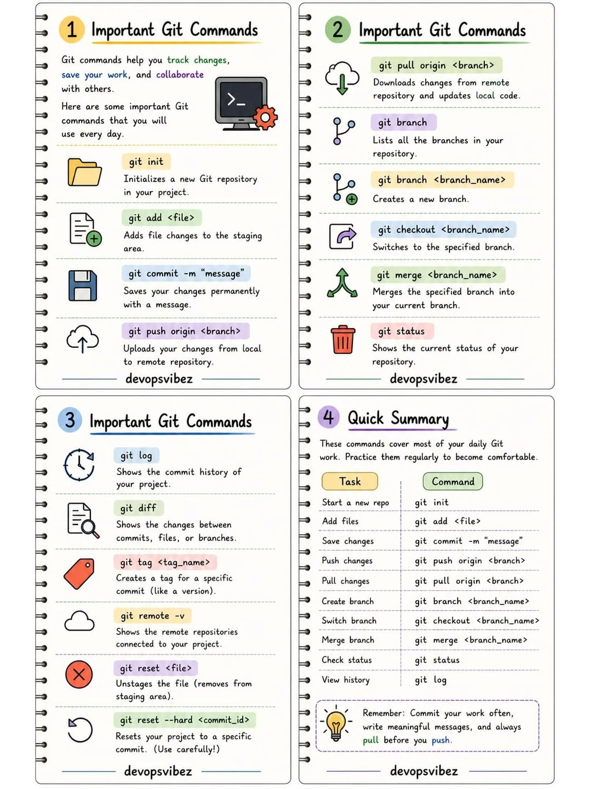
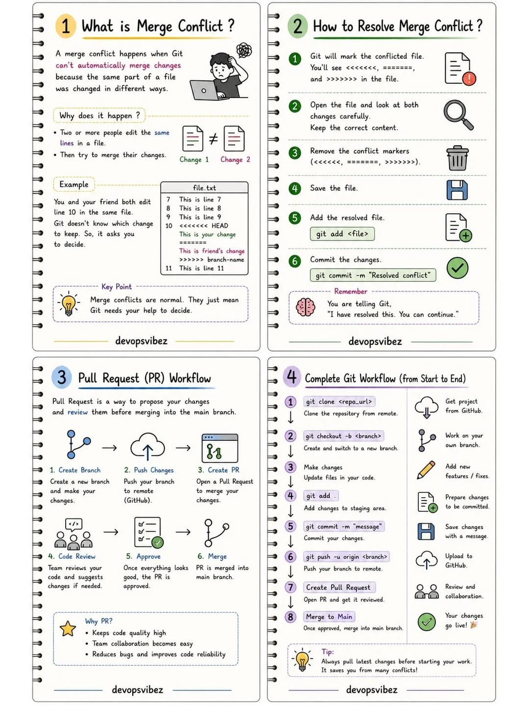
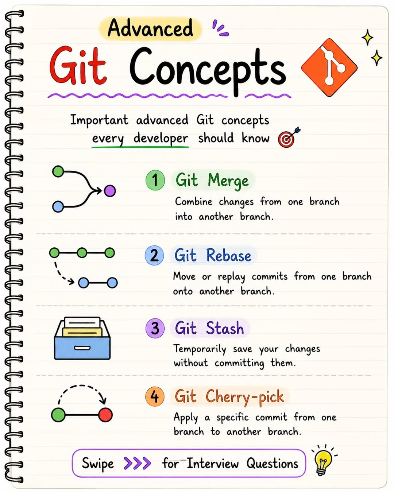
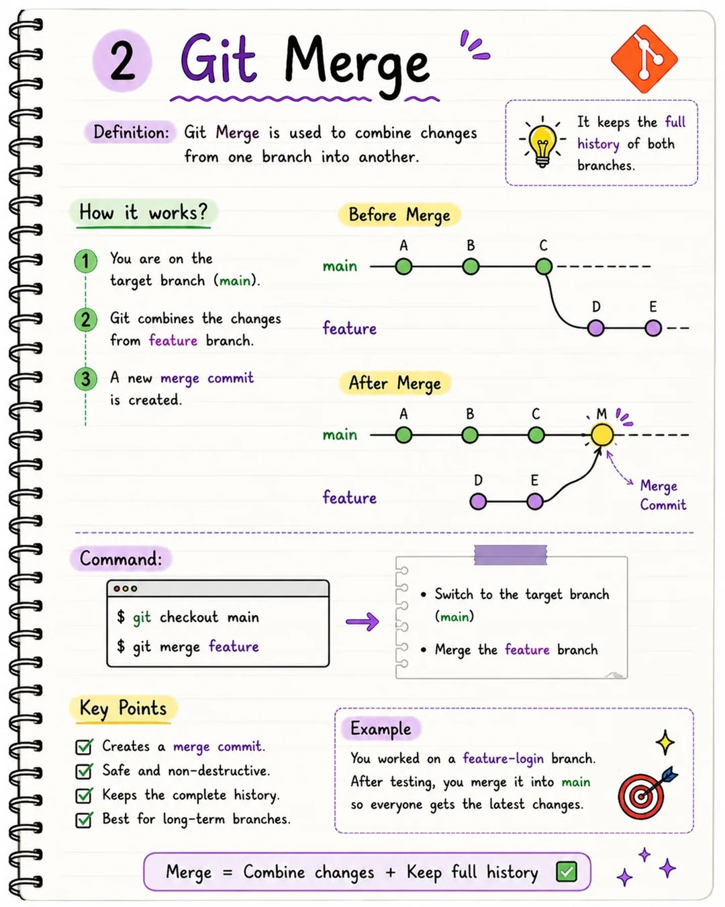
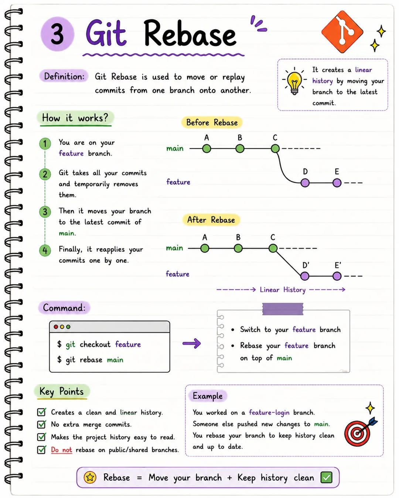
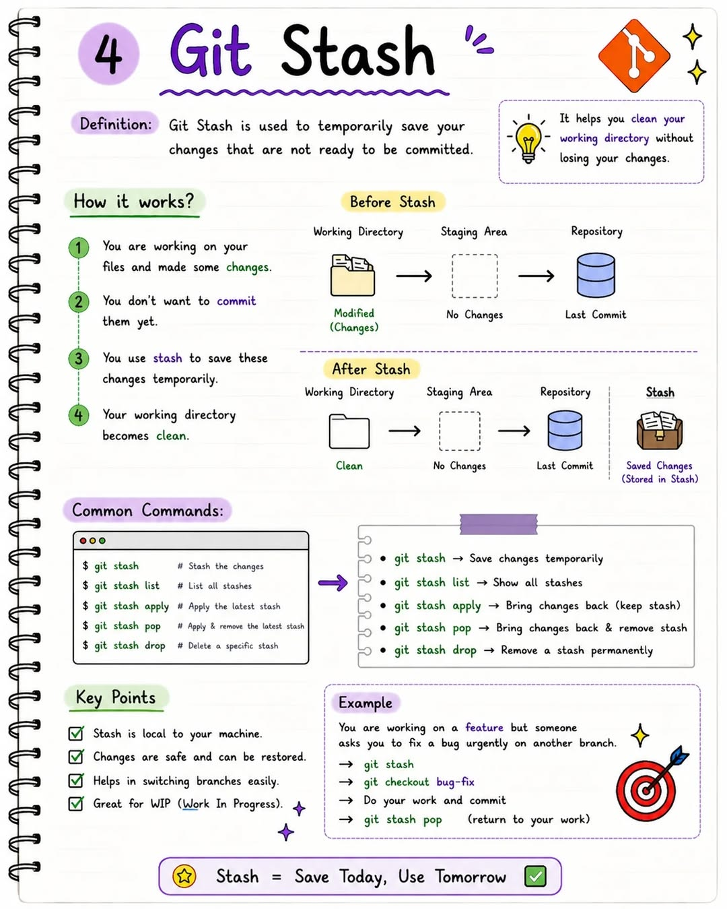
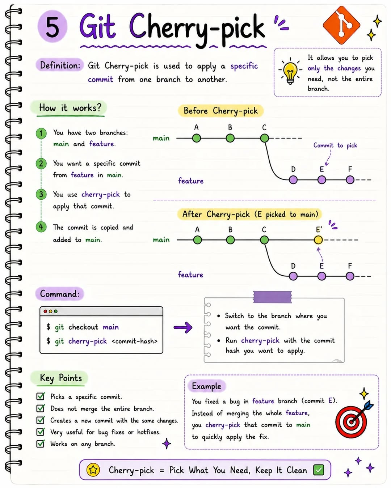

# 🚀 Git & GitHub — From Basics to Advanced

This repository documents my complete learning journey of Git and GitHub — from understanding version control fundamentals to exploring advanced workflows used in real-world development.

Instead of only memorizing commands, I focused on understanding:

- Why Git is important
- How developers collaborate using GitHub
- How real-world workflows actually work
- How to manage code safely and efficiently

---

# 📚 Topics Covered

This repository includes:

## 🟢 Git Basics
- What is Git?
- What is Version Control?
- Why Git is important
- Git vs GitHub

## 🌿 Branching & Collaboration
- Creating branches
- Feature branch workflow
- Collaboration using GitHub
- Pull Requests

## ⚙️ Common Git Commands
- `git init`
- `git add`
- `git commit`
- `git push`
- `git pull`
- `git clone`
- `git status`

## 🔥 Advanced Git Concepts
- Git Merge
- Git Rebase
- Git Stash
- Git Cherry-pick
- Merge Conflicts
- HEAD & Detached HEAD
- Fetch vs Pull
- Reset vs Revert

---

# 📷 Visual Learning Notes

These visual notes helped me understand Git concepts faster and more clearly.

---

# 🟢 Git Basics

These notes explain:
- What Git is
- Why version control matters
- How GitHub helps in collaboration

---

# 🌿 Git Branching

Branching allows multiple developers to work independently without affecting the main project.

Topics included:
- Feature branches
- Main branch workflow
- Safe development practices

---

# ⚙️ Git Commands

Commonly used Git commands with practical understanding.

Commands covered:
- `git init`
- `git add`
- `git commit`
- `git push`
- `git pull`

---

# 🚀 Advanced Git Concepts Overview

A quick overview of important advanced Git concepts every developer should know.

Includes:
- Merge
- Rebase
- Stash
- Cherry-pick

---

# 🔀 Git Merge

Git Merge combines changes from one branch into another branch while preserving complete history.

### Key Points
- Creates a merge commit
- Safe and non-destructive
- Best for long-term branches

---

# ♻️ Git Rebase

Git Rebase moves or replays commits onto another branch to create a cleaner linear history.

### Key Points
- Creates clean history
- No extra merge commits
- Makes history easier to read

---

# 📦 Git Stash

Git Stash temporarily saves uncommitted changes so you can switch branches safely.

### Key Points
- Saves work temporarily
- Keeps working directory clean
- Useful during context switching

---

# 🍒 Git Cherry-pick

Git Cherry-pick allows applying a specific commit from one branch to another.

### Key Points
- Picks only required commits
- Useful for hotfixes
- Avoids merging full branch

---

# 🎯 Important Git Interview Questions

A collection of important Git interview questions including:

- Merge vs Rebase
- Fetch vs Pull
- Reset vs Revert
- What is HEAD?
- Detached HEAD state
- Merge conflicts

---

# 💡 What I Learned

While building this repository, I learned:

- Git is more about managing changes than memorizing commands
- Good commit messages improve collaboration
- Branching makes teamwork safer and cleaner
- Git helps recover mistakes easily
- Understanding workflows is more important than remembering syntax

---

# 🧠 My Understanding (Simple Definition)

> Git is like a timeline of your project.

> GitHub is where developers share and collaborate on that timeline.

---

# 🎯 Why I Created This Repository

I made this repository to:

- Strengthen my Git fundamentals
- Practice real-world Git workflows
- Build better development habits
- Create beginner-friendly learning notes
- Track my learning progress

---

# 🚀 Future Improvements

Planned improvements:

- Add real project workflow examples
- Practice advanced branching strategies
- Learn GitHub Actions
- Improve commit conventions
- Add open-source collaboration examples

---

# 🤝 Final Note

This repository reflects my practical understanding of Git and GitHub as a learner and developer.

I’ll continue improving it as I explore more advanced workflows and real-world development practices.

---

# ⭐ If you found this helpful

Feel free to star the repository and use these notes for learning Git & GitHub.

Happy Learning 🚀
